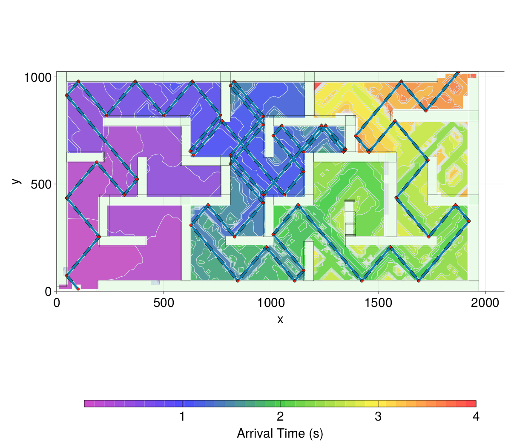
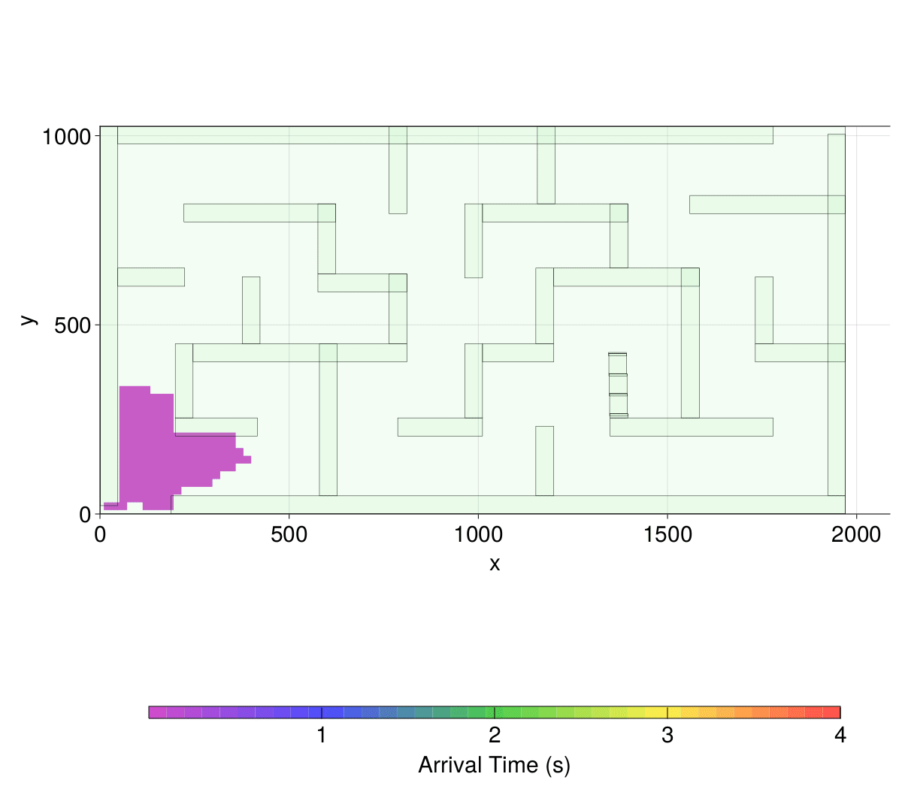
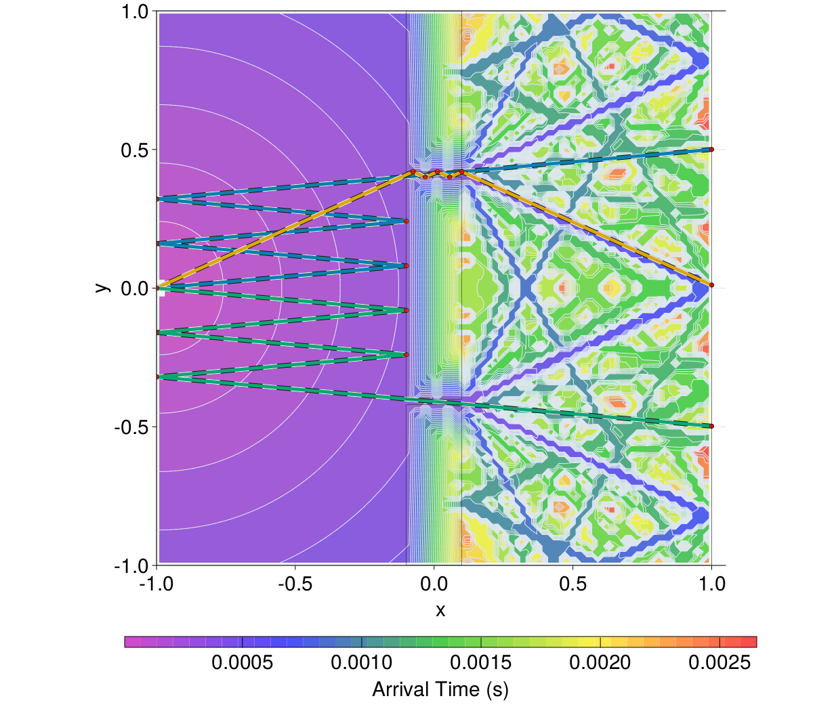
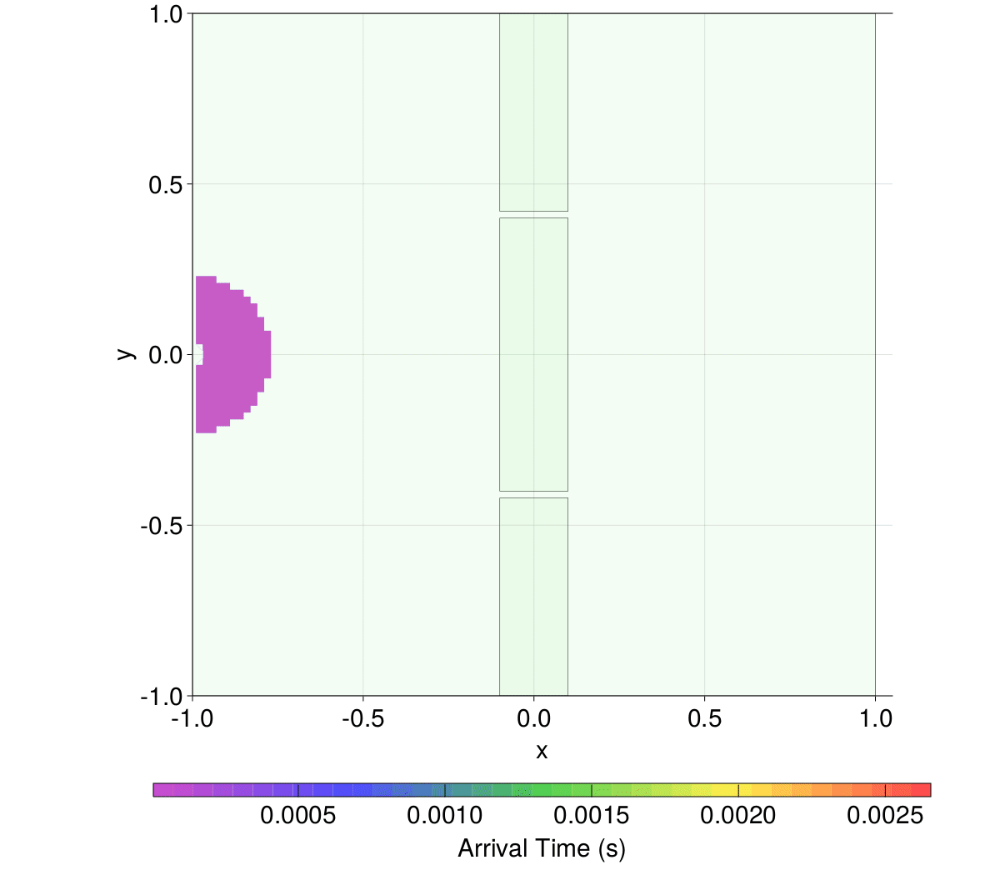

# Rayons.jl

This project simulates optical rays interacting with a 2D geometry composed of a set of rectangles with different optical velocities.

Minimal travel times from a given source to a set of sensors are computed.

The ray interacting with a (plane) boundary is split into **two sub-rays** (**reflected** and **refracted**) via the following recursive function :

```julia
function recursive_generate_rays_fluid!(reduce_ray!, state,celerity_domain, idx, time,
                        u::Point, pstart::Point, np::NumericalParameters, depth, power)
    c₁,_,ρ₁ = cl_ct_rho(state)
    u=normalize(u)
    pend, pnext,uθ,state,next_state = advance_ds(pstart, u, np, state,celerity_domain)
    c₂,_,ρ₂ = cl_ct_rho(next_state)

    Δt = norm(pend - pstart) / c₁   
    time += Δt
    
    reduce_ray!(pstart, pend, c₁, time, idx,power)
    
    if depth <= np.maxdepth && time <= np.tmax  && power>np.power_threshold

        uθr = maybeuθr(uθ, c₁, c₂) # refracted angle θr from incident angle θ      
        r,t = isnothing(uθr) ? (1.0,0.0) : rtpower_coeffs_fluid_fluid(uθr, uθ, c₁, c₂, ρ₁, ρ₂)
        # reflection αf(α,θ,θ) =  π + α - θ - θᵣ 
        recursive_generate_rays_fluid!(reduce_ray!, state,celerity_domain, 2idx, time,
                                                uαf(u,uθ,uθ), pend, np, depth+1, r*power) 
        # refraction α + θᵣ - θ
        !isnothing(uθr) && 
        recursive_generate_rays_fluid!(reduce_ray!, next_state,celerity_domain, 2idx+1, time,
                                                uαr(u,uθ,uθr), pnext, np, depth+1, t*power)
    end
end
```
Note how different **reduction** functions (`reduce_ray!`) can be passed to the recursive function. In particular, we can pass a function computing the minimal arrival time of a given ray into each cell of a 2D Cartesian grid.

A first example corresponding to a maze can be launched via the following script

```julia
julia> include("go_maze.jl")
````
Producing the following contour plot of arrival times as well as the shortest path from the source to the sensor placed at the opposite side of the maze :



This case is super simple because the velocity of the walls is super small. In such case, only reflected rays are significant.
The following animation illustrates the arrival times through the maze :



A second example corresponds to a wall with two holes :

```julia
julia> include("go_test1.jl")
````



In this case both reflected and refracted rays must be considered.

he following animation illustrates the arrival times through the maze :



